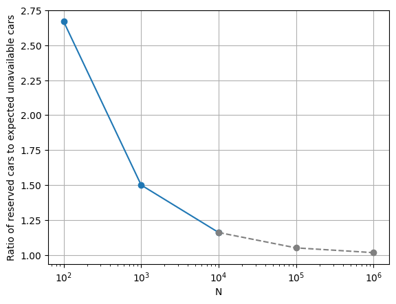

This post is inspired by the article [The Fallacy of Large Numbers](https://www.lesswrong.com/posts/R8DBQD72tajt4mDhv/the-fallacy-of-large-numbers) and the comments on it.

The article considers the following example. You have 100 cars, and the failure rate of each car is 3%. We assume that failures are independent. How many cars should you reserve each day to ensure good customer service?

The Law of Large Numbers states that as the number of trials increases, the average of the results gets closer to the expected value. If we blindly apply it, we would expect 3 cars to fail each day, so reserving 3-4 cars should be enough, right? Let's compute.

The number of failures follows a binomial distribution with parameters $N = 100$ and $p = 0.03$.

```python
from math import comb

def pmf(x, p=0.03):
    return comb(100, x) * p**x * (1-p)**(100-x)

more_than_4_unavailable = 1 - sum(pmf(x) for x in range(0, 5))
more_than_4_unavailable  # 0.18214
```

The probability that more than 4 cars are unavailable is 18.2%. This means that if we reserve 4 cars, we will have a bad customer service experience 18.2% of the time, which is roughly 5-6 days per month. If we reserve 8 cars, the probability that more than 8 are unavailable drops to 0.00321, which means a bad experience approximately once a year. The issue here is that the tail of the distribution is much heavier than we might expect.

### Detour...

Let us make a small detour. The code above will not work for large $N$. `comb(N, x)` returns an integer, which in Python has arbitrary precision, so that part is fine. But $p^x$ and $(1-p)^{N-x}$ are floats. To multiply an integer with a float, the integer is converted to a float, whose representation has a ceiling. So for large $N$ the code will fail with an overflow error.

Moreover, this code has another numerical issue. Or even two. One is underflow, when $p^x$ becomes too small and leaves the representable range. The other comes from the fact that not all numbers can be represented exactly in floating point. Each number, when stored in a computer, carries a small relative error $\epsilon$, and that relative error is amplified by exponentiation. Raising to the power $N-x$ inflates the relative error to roughly $(N-x)\,\epsilon$.

The fix is to work in log space, where multiplications become sums and everything giant or tiny becomes moderate. To compute the binomial coefficient we use the gamma function, a continuous extension of the factorial:

$$\log \binom{N}{x} = \log \frac{N!}{x!\,(N-x)!} = \log N! - \log x! - \log (N-x)! = \log \Gamma(N+1) - \log \Gamma(x+1) - \log \Gamma(N-x+1)$$

The log-gamma function is implemented in Python as `math.lgamma`.

```python
from math import lgamma, log, exp

def log_pmf(x, N=100, p=0.03):
    log_c = lgamma(N+1) - lgamma(x+1) - lgamma(N-x+1)
    return log_c + x*log(p) + (N-x)*log(1-p)

more_than_4_unavailable = 1 - sum(exp(log_pmf(x)) for x in range(0, 5))
```

### Thinner tails with more trials

Let us now increase the number of cars to 1000, while keeping the failure rate at 3%, so about 30 cars are expected to fail each day. To ensure a bad experience only about once a year, we need to reserve about 45 cars each day, which is much closer to the expected value of 30 than in the previous example.

With 10000 cars, we would expect 300 failures each day. To keep the bad-experience rate at about once a year, we need to reserve about 347 cars.

Let us consider all the cases together:

| Number of cars | Expected failures | Reserved cars | Reserved / expected |
| --- | --- | --- | --- |
| 100 | 3 | 8 | 2.67 |
| 1000 | 30 | 45 | 1.5 |
| 10000 | 300 | 347 | 1.16 |



As the number of cars increases, the tail of the failure distribution becomes thinner. This means we can reserve fewer cars *relative to* the expected number of failures while still maintaining a low probability of a bad customer service experience. The ratio decreases proportionally to the square root of the number of cars, which is consistent with the fact that the standard deviation of a binomial distribution is proportional to the square root of the number of trials. It is also worth mentioning that, by the central limit theorem, the failure distribution approaches a normal distribution as the number of cars grows.

## Poisson approximation

Another interesting aspect of this problem is that when the number of cars is large and the failure rate is small, we can use the Poisson approximation to the binomial distribution.

In our case $N = 100$ and $p = 0.03$, so the expected number of failures is $\lambda = N p = 3$. The probability of more than 4 failures can then be estimated as:

```python
from scipy.stats import poisson
poisson.sf(4, 3)  # 0.18474
```

But notice that we get the same $\lambda$ for $N = 1000$ and $p = 0.003$, and for $N = 10000$ and $p = 0.0003$. In all these cases the Poisson approximation is identical, and so is the number of cars we need to reserve! (Although reserving 8 cars out of 1000 feels more comfortable than reserving 8 out of 100.)

This brings us to another lesson from the article: our intuition fails not only because "100 is not large", but really because "$\lambda = 3$ is small". When the expected number of events is small, the fluctuations around it are unintuitively large. For small $\lambda$, the Poisson distribution is wide relative to its mean.
