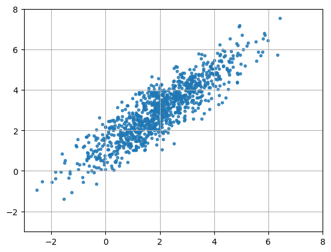
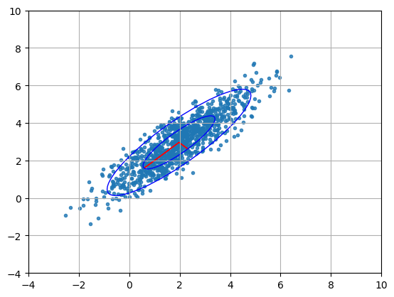
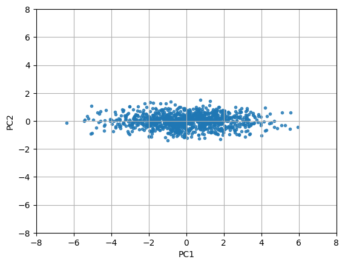

# Principal Component Analysis (PCA)


Let's say we have a dataset with $n$ samples and $m$ features where $n \geq m$, represented as a matrix $X \in \mathbb{R}^{n \times m}$. The goal of PCA is to reduce the dimensionality of this dataset while preserving as much variance (information) as possible. Rows of matrix $X$ represent observations or samples, and columns represent features or variables. 


First, we center features so that each feature vector has a mean of zero:

$$
B = X - \frac{1}{n}\mathbf{1}\mathbf{1}^T X.
$$

Then we compute the $m \times m$ covariance matrix of the centered data:

$$
C = \frac{1}{n-1} B^T B,
$$

where each element $C_{ij} = \operatorname{cov}(B_{\cdot i}, B_{\cdot j}) = \frac{1}{n-1} B_{\cdot i}^T B_{\cdot j}$ is a scaled dot product of centered feature vectors.  Matrix $C$ is symmetric and positive semi-definite, so it has real non-negative eigenvalues and orthogonal eigenvectors.  


Next, we perform eigen decomposition of the covariance matrix $C$ to find its eigenvalues and eigenvectors:

$$
CV = VD,
$$

where $V$ is a matrix whose columns are the eigenvectors of $C$, and $D = \text{diag}(\lambda_1, \lambda_2, \dots, \lambda_m)$ is a diagonal matrix containing the corresponding eigenvalues. 

Then 

$$
V^T B^T B V = (BV)^T (BV) = (n-1) D.
$$

Vectors $Bv_j$ are projections of the original data onto the corresponding eigenvectors $v_j$, and are called principal components.  Vectors $v_j$ form an orthogonal basis for the feature space, so the projections $Bv_j$ are uncorrelated. Then the variance of each projection is equal to the corresponding eigenvalue $\lambda_j$:

$$
\operatorname{var}(Bv_j) = \frac{1}{n-1} \sum_{i=1}^{n} \big((Bv_j)_i - \overline{Bv_j}\big)^2 = \frac{1}{n-1} \lVert Bv_j \rVert_2^2 = \lambda_j,
$$

where we have used the fact that $Bv_j$ is centered, i.e., $\overline{Bv_j} = 0$.

In summary, we have found such a rotation of the original feature space that the new features in a rotated space are uncorrelated and have variances equal to the eigenvalues of the covariance matrix. By selecting principal components corresponding to the largest eigenvalues, we uncover the most dominant combinations of original features. This allows us to reduce the dimensionality of the dataset while retaining the most important information.


Another way to understand PCA is through Singular Value Decomposition (SVD). We can perform SVD on the centered data matrix $B$:

$$
B = U \Sigma V^T, 
$$

where $U \in \mathbb{R}^{n \times n}$ is an orthogonal matrix whose columns are the left singular vectors, $\Sigma \in \mathbb{R}^{n \times m}$ is a rectangular diagonal matrix containing the singular values $\sigma_1, \sigma_2, \dots, \sigma_m$, and $V \in \mathbb{R}^{m \times m}$ is an orthogonal matrix whose columns are the right singular vectors.

Then $B^T B$ can be expressed as:

$$
B^T B = V \Sigma^T U^T U \Sigma V^T = V \Sigma^T \Sigma V^T.
$$

Comparing this with the eigen decomposition $C= VDV^T$, we see that $\Sigma^T \Sigma = (n-1)D$, and the singular values $\sigma_j$ of $B$ are related to the eigenvalues $\lambda_j$ of the covariance matrix $C$ by $\sigma_j = \sqrt{(n-1)\lambda_j}$.


Then $B V = U \Sigma$, and $Bv_j = \sigma_j u_j$ for $j = 1, 2, \dots, m$. Vectors $u_j$ are unit vectors, and singular values $\sigma_j$ are the lengths of the projections $Bv_j$. 

## Linearity of PCA

Note that principal components are linear combinations of the original features. This is a limitation of PCA, as it cannot capture non-linear relationships in the data. For datasets with complex structures, non-linear dimensionality reduction techniques such as t-SNE may be more appropriate.


## PCA of the Gaussian cluster

We create a Gaussian point cloud in 2D, stretch it along the x-axis and compress it along the y-axis, rotate it by $\pi/4$ radians, and move its center to $(2, 3)$:

```python
import numpy as np

# create a random gaussian cloud of points in 2D
n = 1000
X = np.random.randn(n,2)

# stretch the cloud along the x-axis and compress it along the y-axis
S = np.diag([2, 0.5])
X = X @ S

# rotate the cloud by pi/4 radians
theta = np.pi/4
R = np.array([[np.cos(theta), np.sin(theta)],
              [-np.sin(theta), np.cos(theta)]])
X = X @ R

# move center of cloud to (2, 3)
X += np.array([2, 3])
```



We center the data and compute SVD of the centered data matrix:

```python
U, S, Vt = np.linalg.svd(X - X.mean(axis=0))
```

We can recover the standard deviations along the principal axes from the singular values:

```python
std = S / np.sqrt(n-1) # ex.: array([1.94975836, 0.49106255])
```

Matrix $Vt$ contains the eigenvectors of the covariance matrix of the centered data as rows. So, these are the principal axes of the Gaussian cluster. We visualize the principal axes and ellipses corresponding to 1 and 2 standard deviations from the mean:

```python
import matplotlib.pyplot as plt
fig = plt.figure()
plt.scatter(X[:, 0], X[:, 1])
# plot the principal components
for i in range(2):
    plt.arrow(X.mean(axis=0)[0], X.mean(axis=0)[1],
              std[i] * Vt[i, 0], std[i] * Vt[i, 1],
              head_width=0.0, head_length=0.0, color='red')
# plot the 1-sigma ellipse
from matplotlib.patches import Ellipse
ellipse = Ellipse(X.mean(axis=0), 2*std[0], 2*std[1], angle=np.degrees(np.arctan2(Vt[0, 1], Vt[0, 0])), edgecolor='blue', facecolor='none')
plt.gca().add_patch(ellipse)
# plot the 2-sigma ellipse
ellipse = Ellipse(X.mean(axis=0), 4*std[0], 4*std[1], angle=np.degrees(np.arctan2(Vt[0, 1], Vt[0, 0])), edgecolor='blue', facecolor='none')
plt.gca().add_patch(ellipse)
plt.xlim(-4, 10)
plt.ylim(-4, 10)
plt.grid()
```




And then we compute principal components by projecting the centered data onto the principal axes:

```python
PC = (X - X.mean(axis=0)) @ Vt.T
```




This example illustrates how PCA can be used to identify the principal axes of a dataset and visualize the variance along those axes. Here we did not exercise any dimensionality reduction. Usually, one would select the first $k$ principal components corresponding to the $k$ largest eigenvalues.